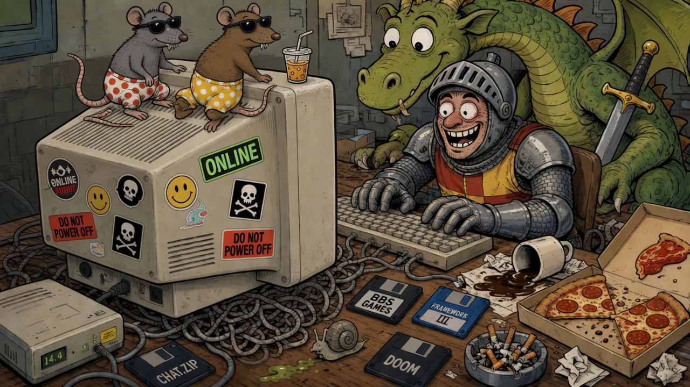

[EN](README.md) | [ES](README.ES.md) | [FR](README.FR.md) | [**DE**](README.DE.md)



# grok2telegram

Tischregeln: [docs/SAFETY.md](docs/SAFETY.md).

Komm rein, häng den Mantel auf. Die Taverne ist eine **Telegram-Gruppe**. Der Spielleiter ist ein **Grok Agent Bot** auf **seiner eigenen VM** — nicht auf deinem Laptop, nicht unter dem Schreibtisch neben dem Pentium, der noch nach 1996 riecht.

Wandernder Bruder von [grokgame](https://github.com/antonio-castellon/grokgame).  
`grokgame` = der Tisch **auf deinem PC**.  
`grok2telegram` = dieselbe `/cmd`-Pipe **ohne Heimserver und ohne `XAI_API_KEY`**.

Du bringst Freunde. Mesa bringt Würfel, ASCII-Karten und verdächtig gutes Timing.

---

## Wozu das Ganze?

Weil jemand sagte: *„Können wir richtig am Telegram-Tisch spielen, ohne dass ich einen Prozess auf dem Desktop PC babysitte?“*

Ja.

- Spieler tippen in der Gruppe wie in einem BBS-Door-Game.
- Eine dünne **Python-Bridge** long-pollt (`getUpdates`) und antwortet mit BBS-Karten in HTML `<pre>`.
- Was ein echtes SL-Gehirn braucht, landet in einer **Inbox**. **Mesa** (der Agent) wacht auf, erzählt, erfindet Verben, schickt ein `say`.
- Der Laptop ist **nicht** im Pfad. Keine eingehenden Ports. Der Agent *ist* der Sprecher.

Starte **nicht** diese Schleife und `grokgame`s `getUpdates` gleichzeitig mit dem **selben** Token. Telegram wählt Favoriten; der andere heult `409 Conflict`.

---

## Architektur (Serviette)

```
  Abenteurer
      │
      ▼
 Telegram-Gruppe ──HTTPS──►  api.telegram.org
                                  ▲
                                  │ getUpdates / sendMessage
                                  │
                     ┌────────────┴────────────┐
                     │  Python-Bridge (VM)     │
                     │  · parse /cmd & @bot    │
                     │  · System-Verben        │
                     │  · SL-Warteschlange     │
                     │  · BBS-Skin (WIDTH=28)  │
                     └────────────┬────────────┘
                                  │ data/inbox.jsonl
                                  ▼
                     ┌─────────────────────────┐
                     │  Mesa (Grok-Agent)      │
                     │  erfindet, erzählt      │
                     │  drain → bridge.send    │
                     └─────────────────────────┘
```

### Wer macht was?

| Schicht | Aufgabe | Tempo |
|---|---|---|
| **Bridge** | Hört immer zu. Beantwortet **System**-Verben sofort (`help`, `status`, `clear`, …). | Sofort |
| **Inbox** | Parkplatz für Gehirn (`new-game`, freies `@bot`, Spielverben). Ack: „Te leo…“ | Warteschlange |
| **Mesa** | Liest die Queue, spricht `table.lang`, hält `chat_*.json`, erklärt nie das Protokoll in der Gruppe. | Beim Wake (Webhook falls verdrahtet; sonst ~5-Min-Netz) |

Die Bridge bleibt **absichtlich dünn**. Sie erklärt Befehle. Sie spielt nicht SL für „du bist dran, zieh eine Karte“. (Haben wir versucht. Die Bridge wurde übermütig. Der Caballo de Oros vergisst nicht.)

---

## Befehle

Gleiche Grammatik wie grokgame:

```
/cmd <verb> [payload]
@dein_bot <verb> [payload]
@dein_bot <Freitext>     → Inbox-Verb "ask"
```

### System (Bridge, sofort)

| Verb | Wirkung |
|---|---|
| `help` / `help <verb>` / `help extended` | Die heilige Schriftrolle. |
| `whoami` | Deine Id, Admin ja/nein. |
| `lang` | Tischsprache: `es` `en` `fr` `de`. |
| `status` | Titel, Phase, **joined Spieler (nur Namen)**, Regeln, Limits. |
| `rules` / `limit` | Regeln / Limits. |
| `cmd list` | System + Mesas Erfindungen. |
| `clear` / `clear all` | Admin: Nachrichten löschen. |
| `restart` | Admin: gleiches Spiel, Hände weg. |
| `unjoin` | Tisch verlassen. |
| `grant` / `revoke` | Admins. |
| `reset` | Neue Lobby. |

### Spiel (Mesa, nach `new-game`)

Mesa erfindet sie. Klassiker: `new-game`, `join`, dann der Rest. Sonst → Inbox → Antwort in Rolle.

**`new-game`-Protokoll:** unklar → kurze Fragen (Lobby). Klar → ASCII-Titel, Kurzanleitung, `/cmd join`.

---

## Start

**Setup:** [SETUP.md](SETUP.md).  
**SL-Doktrin:** [docs/AGENT.md](docs/AGENT.md).

```bash
cp .env.example .env
python -m venv .venv && . .venv/bin/activate
pip install -r requirements.txt
scripts/start.sh
scripts/healthcheck.sh
```

Optional: `MESA_WAKE_URL` / `MESA_WAKE_KEY` für sofortigen SL-Wake (Key nie committen).

---

## Ein-Poller-Regel

Ein Token. Ein `getUpdates`.  
Diese VM **oder** die PC-Taverne — nicht beides.

---

*Münze einwerfen. `/cmd help`. Keinen Roman vor `/cmd join`.*
