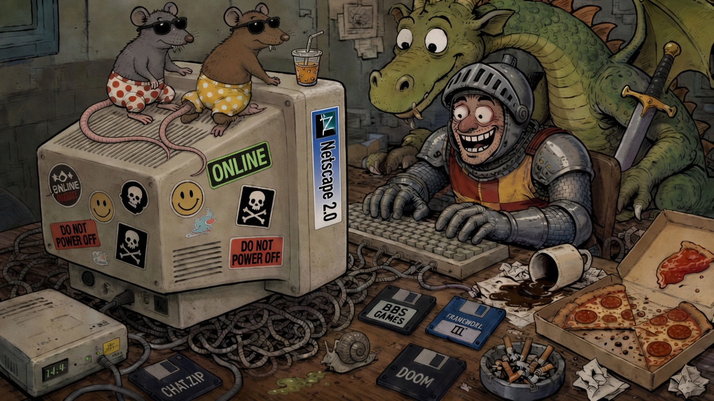

[EN](README.md) | [ES](README.ES.md) | [**FR**](README.FR.md) | [DE](README.DE.md)



# grok2telegram

Règles de la table : [docs/SAFETY.md](docs/SAFETY.md).

C’est une expérience avec une idée ridicule et une excuse adorable — un **fork de [grokgame](https://github.com/antonio-castellon/grokgame)** pour que le Desktop PC puisse enfin aller se coucher.

**Un agent peut-il être le maître du donjon ?** Pas un moteur de règles de 400 pages d’errata. Un cerveau. Ce soir, il mène une chasse au dragon. Demain, il sert le 21. Samedi, il devient un Parchís particulièrement rancunier. Le même groupe, les mêmes copains, une autre table.

Le canal, c’est **Telegram**, exprès. Les enfants l’ont déjà. Les parents aussi. Personne n’a à installer *Yet Another Game Client 3.2 (bêta)* ni à créer un compte `xXSorcierSombre2009Xx`. Si le téléphone sait écrire dans un groupe, il a déjà une chaise à cette table.

C’est le vieil internet qui se faufile par une porte moderne. Avant que les cartes graphiques n’aient plus de ventilateurs qu’un stade, on jouait sur des **BBS**, des donjons ASCII et des MUD où un dragon tenait en trois caractères de feu et beaucoup d’imagination :

```
  /\
 /  \    "Tu entends des dés dans le noir."
< DM >
 \  /
  \/
```

La même énergie. Tu tapes une commande. Tu reçois une histoire. Vous vous disputez pour savoir si l’orc avait vraiment une ligne de vue. Le tapis, c’est un chat ; le maître, c’est Grok.

La première table, je l’ai faite **pour le fun, pour mon fils**, pour qu’il embarque ses amis sans livre de règles, sans boutique, sans « 40 Go minimum ». Un groupe. Un bot. Un adulte tape `/cmd new-game …` en langage humain. Grok invente le reste.

**Ce fork est le second défi :** peut-on faire ça **sans nounouter un process Python sur le Desktop PC** ? Ici le tuyau `/cmd` vit sur la **VM de l’Agent Bot**. Pas de serveur à la maison. Pas de `XAI_API_KEY`. Si un agent peut être MJ ce soir, il peut être quizmaster demain, moniteur de colo, démon des devoirs, conteur de famille — les jeux d’abord, d’autres tables ensuite.

Si ça marche, on a une taverne de poche qui n’a pas besoin du PC allumé. Sinon, on a quand même une soirée bizarre et des cartes ASCII. Dans les deux cas : le chevalier reste sur la boîte, les enfants restent sur Telegram, et l’adulte n’a pas à expliquer Steam *ni* `systemd` à un gamin de douze ans à 22 h 17.

**Envie d’ouvrir ta propre table ?** Le mode d’emploi (nécessairement ennuyeux) est dans **[SETUP.md](SETUP.md)**.

Ne lance **pas** cette boucle et le `getUpdates` de `grokgame` en même temps sur le **même** token. Telegram choisit un favori ; l’autre pleure `409 Conflict`.

---

## Architecture (serviette)

```
  Aventuriers
      │
      ▼
 Groupe Telegram ──HTTPS──►  api.telegram.org
                                  ▲
                                  │ getUpdates / sendMessage
                                  │
                     ┌────────────┴────────────┐
                     │  Bridge Python (VM)     │
                     │  · parse /cmd & @bot    │
                     │  · verbes système       │
                     │  · file d’attente MJ    │
                     │  · skin BBS (WIDTH=28)  │
                     └────────────┬────────────┘
                                  │ data/inbox.jsonl
                                  ▼
                     ┌─────────────────────────┐
                     │  Mesa (Agent Grok)      │
                     │  invente, narre, joue   │
                     │  drain → bridge.send    │
                     └─────────────────────────┘
```

### Qui fait quoi ?

| Couche | Rôle | Vitesse |
|---|---|---|
| **Bridge** | Écoute toujours. Répond aux verbes **système** tout de suite (`help`, `status`, `clear`, …). | Instantané |
| **Inbox** | Parking pour le cerveau (`new-game`, `@bot` libre, verbes de partie). Ack : « Te leo… » | File |
| **Mesa** | Lit la file, parle en `table.lang`, tient `chat_*.json`, n’explique jamais le protocole dans le groupe. | Au réveil (webhook si branché ; sinon filet ~5 min) |

Le bridge reste **volontairement mince**. Il enseigne les commandes. Il ne joue pas au MJ pour « c’est ton tour, prends une carte ». (On a essayé. Le bridge s’est pris pour un caballero. Oros n’oublie pas.)

---

## Commandes

Même grammaire que grokgame :

```
/cmd <verbe> [payload]
@ton_bot <verbe> [payload]
@ton_bot <texte libre>     → verbe inbox "ask"
```

### Système (bridge, immédiat)

| Verbe | Effet |
|---|---|
| `help` / `help <verbe>` / `help extended` | Le parchemin. |
| `whoami` | Ton id, admin ou pas. |
| `lang` | Langue de table : `es` `en` `fr` `de`. |
| `status` | Titre, phase, **joueurs joined (noms seuls)**, règles, limites. |
| `rules` / `limit` | Règles / limites. |
| `cmd list` | Système + inventions de Mesa. |
| `clear` / `clear all` | Admin : purge. |
| `restart` | Admin : même partie, scores à zéro. |
| `unjoin` | Quitter la table. |
| `grant` / `revoke` | Admins. |
| `reset` | Nouveau lobby. |

### Partie (Mesa, après `new-game`)

Mesa invente. Classiques : `new-game`, `join`, puis le reste. Sinon → inbox → réponse en personnage.

**Protocole `new-game` :** si c’est flou, questions d’abord (lobby). Sinon : carte ASCII, mode d’emploi, `/cmd join`.

---

## Démarrage

**Install :** [SETUP.md](SETUP.md).  
**Doctrine MJ :** [docs/AGENT.md](docs/AGENT.md).

```bash
cp .env.example .env
python -m venv .venv && . .venv/bin/activate
pip install -r requirements.txt
scripts/start.sh
scripts/healthcheck.sh
```

Optionnel : `MESA_WAKE_URL` / `MESA_WAKE_KEY` pour un réveil MJ immédiat (jamais committer la key).

---

## Règle du poller unique

Un token. Un `getUpdates`.  
Cette VM **ou** la taverne PC — pas les deux.

---

*Insère une pièce. `/cmd help`. Évite le roman avant `/cmd join`.*
