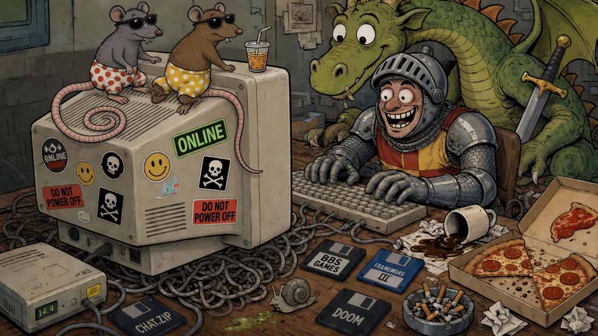

[**EN**](README.md) | [ES](README.ES.md) | [FR](README.FR.md) | [DE](README.DE.md)



# grok2telegram

Table rules: [docs/SAFETY.md](docs/SAFETY.md).

Welcome, traveler. Hang your cloak. The tavern is a **Telegram group**. The Game Master is a **Grok Agent Bot** that lives on **its own cloud VM** — not on your laptop, not under your desk next to the dusty Pentium that still smells like 1996.

This is the wandering sibling of [grokgame](https://github.com/antonio-castellon/grokgame).  
`grokgame` = the board **on your PC**.  
`grok2telegram` = the same `/cmd` pipe **without a house server and without `XAI_API_KEY`**.

You bring friends. Mesa brings dice, ASCII cards, and suspiciously good timing.

---

## Why does this even exist?

Because someone said: *“Can we play a proper tabletop game in Telegram without me babysitting a process on my Desktop PC?”*

Yes.

- Players type in a group chat like it’s a BBS door game.
- One thin **Python bridge** long-polls Telegram (`getUpdates`) and speaks BBS-framed HTML `<pre>` cards back.
- Anything that needs a real GM brain goes into an **inbox**. **Mesa** (the Agent) wakes, narrates, invents verbs, deals destiny, and sends a `say`.
- Your laptop is **not** in the path. No inbound ports. The Agent *is* the process that talks.

Do **not** run this loop and `grokgame`’s `getUpdates` on the **same bot token** at the same time. Telegram will pick a favorite and the other will cry `409 Conflict` into the void.

---

## Architecture (napkin edition)

```
  Adventurers
      │
      ▼
 Telegram group  ──HTTPS──►  api.telegram.org
                                  ▲
                                  │ getUpdates / sendMessage
                                  │
                     ┌────────────┴────────────┐
                     │  Python bridge (VM)     │
                     │  · parse /cmd & @bot    │
                     │  · local system verbs   │
                     │  · enqueue GM verbs     │
                     │  · BBS skin (WIDTH=28)  │
                     └────────────┬────────────┘
                                  │ data/inbox.jsonl
                                  ▼
                     ┌─────────────────────────┐
                     │  Mesa (Grok Agent)      │
                     │  invents games, narrates│
                     │  drain → bridge.send    │
                     └─────────────────────────┘
```

### Who does what?

| Layer | Job | Speed |
|---|---|---|
| **Bridge** | Listen forever. Answer **system** verbs instantly (`help`, `status`, `clear`, …). Frame replies like a SysOp with taste. | Instant |
| **Inbox** | Parking lot for verbs that need a brain (`new-game`, free `@bot` chat, game verbs Mesa invented). Ack: “Te leo…” | Queue |
| **Mesa** | Read the queue, speak in `table.lang`, keep `chat_*.json` honest, never explain the protocol in the group. | On wake (webhook if wired; else ~5 min safety net) |

The bridge stays **thin on purpose**. It teaches commands and flips light switches. It does **not** pretend to understand “it’s your turn, draw a card” — that’s Mesa’s job. (We tried. The bridge got cocky. The caballero of oros remembers.)

---

## Commands

Grammar (same as grokgame):

```
/cmd <verb> [payload]
@your_bot <verb> [payload]
@your_bot <anything in plain language>     → inbox verb "ask"
```

### System verbs (bridge, instant)

| Verb | What it does |
|---|---|
| `help` / `help <verb>` / `help extended` | The sacred scroll. Per-verb lore on request. |
| `whoami` | Your Telegram id and whether you’re admin. |
| `lang` | Table language: `es` `en` `fr` `de`. |
| `status` | Title, phase, **joined players (names only)**, rules, limits. |
| `rules` / `limit` | Append or show house rules / limits. |
| `cmd list` | System verbs + whatever Mesa invented for this game. |
| `clear` / `clear all` | Admin: purge recent messages (bot needs Delete permission). |
| `restart` | Admin: same game, wipe hands/scores, keep rules. |
| `unjoin` | Leave the table (or boot someone if you’re cruel and admin). |
| `grant` / `revoke` | Admin ids. |
| `reset` | Scorched earth. New lobby. |

### Game verbs (Mesa, after `new-game`)

Mesa invents them. Classic starters:

```
/cmd new-game …
/cmd join
```

Then whatever the board needs — `otra`, `planto`, `act`, `look`, `inventory`… If it’s not a system verb, it goes to the inbox and Mesa answers in character.

**`new-game` etiquette:** if the brief is fuzzy, Mesa asks clarifying questions first (still lobby). When clear: ASCII title card, short how-to, invite `/cmd join`.

---

## Run it

**Setup:** [SETUP.md](SETUP.md) (token, admin ids, `GM_BACKEND=agent` on the VM).  
**What Mesa should believe:** [docs/AGENT.md](docs/AGENT.md).

```bash
cp .env.example .env   # fill TELEGRAM_BOT_TOKEN, ADMIN_TELEGRAM_IDS
python -m venv .venv && . .venv/bin/activate
pip install -r requirements.txt
scripts/start.sh
scripts/healthcheck.sh
```

Mock night (no Agent brain, just the pipe):

```bash
GM_BACKEND=mock python -m bridge
```

### Optional: instant GM wake

If Mesa should jump the second something hits the inbox (RPG nights), set in `.env`:

```
MESA_WAKE_URL=https://…/webhook/automation/…
MESA_WAKE_KEY=…          # never commit this
```

The bridge POSTs on every `append_inbox`. Without it, the scheduled drain is the safety net.

---

## Files that matter

```
bridge/          # the pipe (parse, handle, loop, skin, send, drain, wake)
data/            # chat_*.json, inbox.jsonl, pid  (gitignored secrets stay in .env)
scripts/         # start.sh, healthcheck.sh
docs/AGENT.md    # paste-facing GM doctrine
```

Outbound looks like a phone-width BBS card (`WIDTH=28`, HTML `<pre>`). Fixed-width fonts optional; nostalgia mandatory.

---

## One-poller rule

One bot token. One `getUpdates` loop.  
This VM **or** your PC tavern — not both. The SysOp has spoken.

---

*Insert coin. Type `/cmd help`. Try not to @ the bot with a novel before you’ve `/cmd join`’d.*
